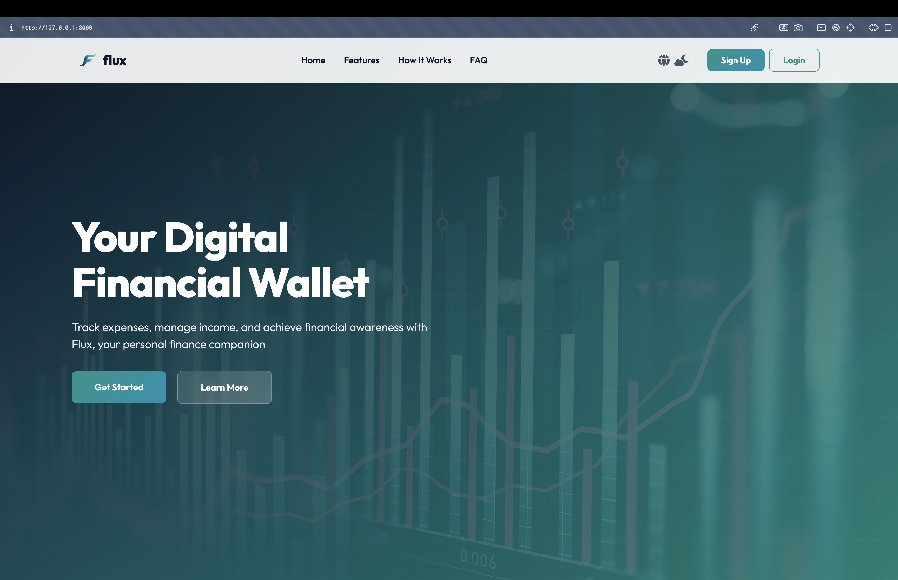
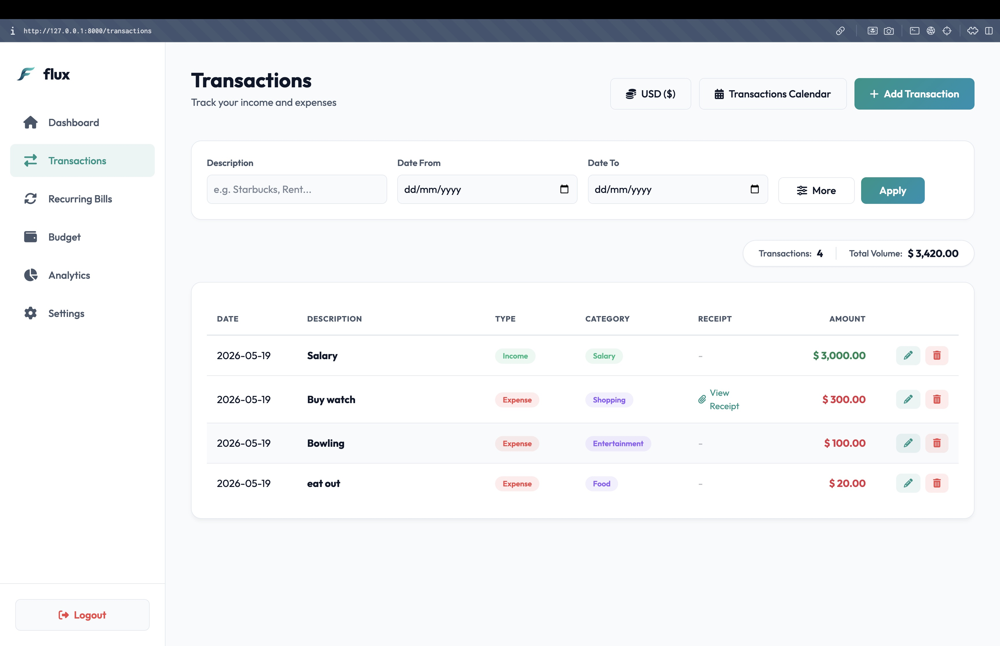
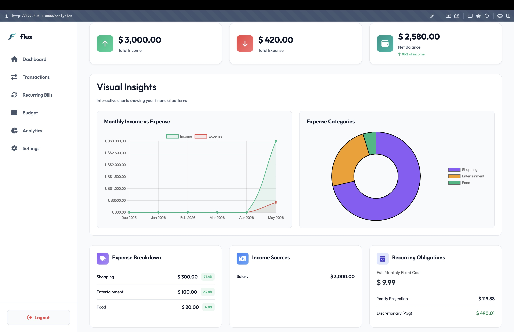
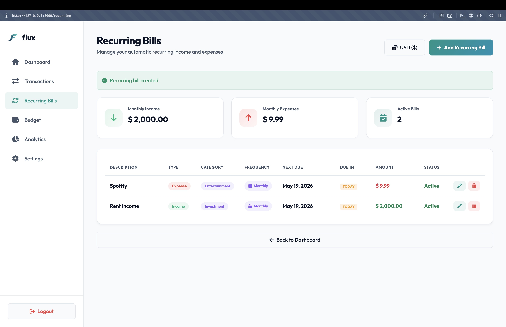

# Flux Budget App

A modern, intuitive budget tracking application designed to help you manage your finances efficiently. Built with Laravel.

## 📸 Screenshots

| Dashboard | Transaction Entry |
|-----------|-------------------|
| <!-- Add Dashboard image here -->  | <!-- Add Transaction image here -->  |

| Monthly Reports | Budget |
|-----------------|----------|
| <!-- Add Reports image here -->  | <!-- Add Settings image here -->  |

*(Note: Replace the image paths in `docs/assets/` with actual screenshots once available.)*

## ✨ Features

- **Dashboard Overview:** Get a quick glance at your total balance, income, and expenses.
- **Transaction Management:** Easily add, edit, or delete income and expense records.
- **Categorization:** Group transactions into custom categories for better tracking.
- **Visual Reports:** View monthly spending breakdowns and trends.
- **Responsive Design:** Accessible on both desktop and mobile devices.

## 🚀 Tech Stack

- **Backend:** Laravel (PHP)
- **Database:** MySQL / SQLite
- **Frontend:** HTML, CSS, JavaScript (Vite)

## 🛠️ Getting Started

Follow these steps to set up the project locally.

### Prerequisites

- PHP 8.1+
- Composer
- Node.js & NPM
- Database (MySQL/SQLite)

### Installation

1. **Clone the repository:**
   ```bash
   git clone https://github.com/yourusername/Flux_Budget_App.git
   cd Flux_Budget_App
   ```

2. **Install dependencies:**
   ```bash
   composer install
   npm install
   ```

3. **Environment Setup:**
   ```bash
   cp .env.example .env
   ```
   Update `.env` with your database credentials.

4. **Generate Application Key:**
   ```bash
   php artisan key:generate
   ```

5. **Run Migrations & Seeders:**
   ```bash
   php artisan migrate --seed
   ```

6. **Build Frontend Assets:**
   ```bash
   npm run build
   # or for development: npm run dev
   ```

7. **Start the Development Server:**
   ```bash
   php artisan serve
   ```

Visit `http://localhost:8000` in your browser.

## 📄 License

The Flux Budget App is open-sourced software licensed under the [MIT license](https://opensource.org/licenses/MIT).
